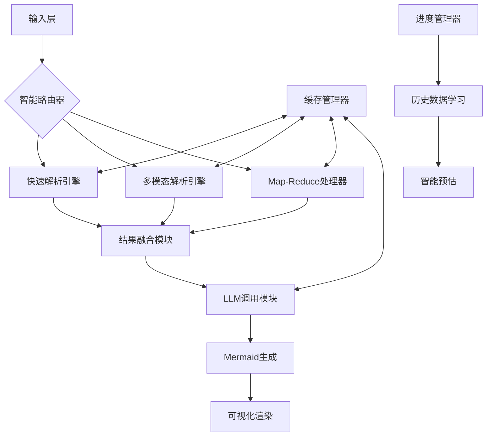

# DocToMermaid 智能文档解析引擎

🚀 基于 Next.js 构建的智能文档解析与图表生成引擎，能够将复杂的PDF文档转换为结构化的Mermaid流程图代码。

[](https://opensource.org/licenses/MIT)
[](https://nextjs.org/)
[](https://reactjs.org/)
[](https://mermaid.js.org/)

## ✨ 核心特性

### 🧠 智能路由系统
- **页面级复杂度分析**：自动检测文档页面的复杂程度
- **策略自动选择**：根据内容复杂度选择最佳解析策略
- **多因素评估**：综合文本密度、图像数量、表格数量等因素

### 🔄 Map-Reduce 大文档处理
- **分块处理**：将大文档智能分割成可处理的小块
- **并行处理**：支持多块并行处理，提升效率
- **结果合并**：将各块处理结果智能合并为最终Mermaid代码
- **上下文突破**：解决大模型上下文长度限制问题

### 👁️ 多模态增强
- **图文结合**：结合PDF文本和页面图像进行分析
- **智能采样**：自动选择关键页面进行图像解析
- **视觉理解**：利用多模态大模型理解复杂布局和图表

### ⚡ 缓存优化
- **多层缓存**：PDF解析、图像渲染、LLM调用结果缓存
- **性能提升**：避免重复计算，显著提升响应速度
- **智能过期**：自动清理过期缓存，保持系统性能

### 🎨 可视化渲染
- **实时预览**：自动渲染Mermaid代码为可视化图表
- **4K高质量导出**：支持PNG和SVG格式的高分辨率图片导出
- **交互控制**：重新渲染、复制代码、导出图片等操作
- **主题适配**：自动适应明暗模式，提供最佳视觉体验

### 📊 智能进度条
- **历史学习**：基于历史处理数据智能预估处理时间
- **准确率显示**：显示预估可信度和历史准确率
- **阶段跟踪**：实时显示当前处理阶段和剩余时间

### 🛡️ 自动降级
- **多层回退**：AI失败时自动回退到规则解析
- **错误恢复**：图像渲染失败时回退到纯文本处理
- **可用性保障**：确保在各种情况下都能产出结果

### 📱 响应式设计
- **移动端优化**：完美适配手机和平板设备
- **自适应布局**：智能调整界面元素和字体大小
- **触控友好**：优化的触控交互体验
- **跨平台兼容**：支持各种屏幕尺寸和设备类型

### 📚 完整使用指南
- **内置帮助系统**：详细的功能说明和使用教程
- **分步指导**：清晰的操作步骤和最佳实践
- **常见问题解答**：涵盖常见使用场景和问题解决
- **技术特性介绍**：深入了解系统能力和优势

## 🏗️ 系统架构



## 🚀 快速开始

### 环境要求

- Node.js 18.0 或更高版本
- npm 或 yarn 包管理器
- 火山引擎豆包大模型 API Key

### 安装步骤

1. **克隆项目**
```bash
git clone https://github.com/Retamev/DocToMermaid.git
cd DocToMermaid
```

2. **安装依赖**
```bash
npm install
# 或
yarn install
```

3. **环境配置**

复制环境变量模板：
```bash
cp .env.example .env.local
```

编辑 `.env.local` 文件：
```env
# 火山引擎API密钥（必需）
VOLC_API_KEY=your_api_key_here

# 可选配置
DEFAULT_LLM_MODEL=doubao-seed-1-6-thinking-250715
MAX_PDF_PAGES=100
MAX_FILE_SIZE_MB=50
CACHE_ENABLED=true
```

4. **启动开发服务器**
```bash
npm run dev
# 或
yarn dev
```

5. **访问应用**

打开浏览器访问 `http://localhost:3000`

## 📖 使用指南

### 🚀 快速开始

1. **上传PDF文件**（支持最大50MB，100页）
2. **选择图表类型和方向**：
   - 支持多种Mermaid图表类型
   - 选择纵向(TB)或横向(LR)布局
3. **配置处理选项**：
   - **多模态**：启用图像+文本联合解析
   - **Map-Reduce**：选择大文档处理策略
4. **点击生成**，观看智能进度条实时反馈
5. **查看结果**：自动渲染的高质量可视化图表
6. **导出和分享**：
   - 4K高质量PNG导出
   - 矢量SVG格式导出
   - 一键复制Mermaid代码

### 🎨 界面功能

#### 主题切换
- **明暗模式**：一键切换明亮/暗黑主题
- **自动适配**：图表渲染自动适应当前主题
- **视觉舒适**：优化的配色方案，减少视觉疲劳

#### 使用指南页面
- **📚 完整文档**：点击"使用指南"按钮访问详细说明
- **功能介绍**：全面了解系统能力和特性
- **使用步骤**：分步骤的操作指导
- **常见问题**：快速解决使用中的疑问
- **技术特性**：深入了解系统架构和优势

#### 联系支持
- **GitHub项目**：直接访问开源代码仓库
- **问题反馈**：通过GitHub Issues提交问题
- **邮箱联系**：reta@cumt.edu.cn
- **微信联系**：Soph0cless

### 📱 移动端使用

#### 响应式体验
- **自适应界面**：完美适配手机和平板屏幕
- **触控优化**：针对触屏设备优化的交互体验
- **字体缩放**：智能调整字体大小，确保可读性
- **布局调整**：元素自动重排，充分利用屏幕空间

#### 移动端特性
- **文件上传**：支持从相册或文件管理器选择PDF
- **手势操作**：支持缩放、滑动等手势交互
- **离线缓存**：处理结果本地缓存，提升访问速度

### 🔧 处理策略详解

#### 智能路由
- **快速解析**：适用于纯文本、结构简单的文档
- **多模态解析**：适用于包含图表、复杂布局的文档
- **自动选择**：系统根据文档特征自动选择最佳策略

#### Map-Reduce选项
- **自动模式**：文档>10k字符或>20页时自动启用
- **强制启用**：始终使用分块处理，适合超大文档
- **禁用模式**：使用传统单次处理，适合小文档

#### 多模态增强
- **图文结合**：同时分析PDF文本和页面图像
- **智能采样**：自动选择关键页面进行深度分析
- **视觉理解**：识别图表、表格、流程图等视觉元素

## 🔧 技术栈

### 前端技术
- **Next.js 14**：React全栈框架
- **React 18**：用户界面库
- **Mermaid.js**：图表渲染引擎
- **html2canvas**：图片导出功能

### 后端技术
- **Node.js**：服务器运行时
- **pdf-parse**：PDF文本解析
- **pdf2pic**：PDF图像渲染
- **OpenAI SDK**：AI模型调用

### AI模型
- **火山引擎豆包**：doubao-seed-1-6-thinking-250715
- **多模态能力**：文本+图像联合理解
- **OpenAI兼容接口**：标准化API调用

## 📊 性能特性

### 处理能力
- 支持PDF文件最大50MB
- 支持最多100页文档
- 智能分块处理，突破上下文限制

### 缓存优化
- PDF解析结果缓存2小时
- 图像渲染结果缓存1小时
- LLM调用结果缓存30分钟
- 智能预估历史数据本地存储

### 错误处理
- 多层降级机制
- 自动重试（最多3次）
- 详细错误日志
- 用户友好的错误提示

## 🚀 部署指南

### Vercel 部署（推荐）

1. **连接GitHub仓库**
   - 在Vercel控制台导入GitHub项目

2. **配置环境变量**
   - `VOLC_API_KEY`：火山引擎API密钥
   - 其他可选配置变量

3. **自动部署**
   - Vercel会自动构建和部署项目

### Docker 部署

```dockerfile
# Dockerfile 示例
FROM node:18-alpine

WORKDIR /app
COPY package*.json ./
RUN npm ci --only=production

COPY . .
RUN npm run build

EXPOSE 3000
CMD ["npm", "start"]
```

### 本地生产环境

```bash
# 构建生产版本
npm run build

# 启动生产服务器
npm start
```

## 📈 监控与统计

系统提供详细的处理统计信息：

- **文档信息**：页数、词数、文件大小
- **处理策略**：使用的解析策略和路由决策
- **性能指标**：处理时间、缓存命中率
- **准确率统计**：预估时间准确率和历史记录
- **复杂度分析**：文档复杂度评分和影响因素

## 🔍 故障排除

### 常见问题

**1. API调用失败**
- 检查`VOLC_API_KEY`是否正确配置
- 确认API密钥有效且有足够配额
- 检查网络连接和防火墙设置

**2. 图像渲染失败**
- 系统会自动回退到纯文本处理
- 检查`pdf2pic`依赖是否正确安装
- 确认系统有GraphicsMagick或ImageMagick

**3. 大文档处理超时**
- 启用Map-Reduce模式
- 考虑减少文档大小或页数
- 检查服务器内存和CPU资源

**4. 内存不足**
- 启用缓存以减少重复计算
- 使用Map-Reduce分块处理
- 增加服务器内存配置

**5. Mermaid渲染错误**
- 检查生成的Mermaid语法
- 查看浏览器控制台错误信息
- 尝试重新渲染或刷新页面

## 🤝 贡献指南

我们欢迎所有形式的贡献！

### 开发环境设置

1. **Fork项目**到你的GitHub账户
2. **克隆Fork的仓库**到本地
3. **创建功能分支**：`git checkout -b feature/amazing-feature`
4. **安装依赖**：`npm install`
5. **启动开发服务器**：`npm run dev`
6. **进行开发和测试**
7. **提交更改**：`git commit -m 'Add amazing feature'`
8. **推送分支**：`git push origin feature/amazing-feature`
9. **创建Pull Request**

### 代码规范

- 使用ESLint和Prettier进行代码格式化
- 遵循React和Next.js最佳实践
- 添加适当的注释和文档
- 确保所有测试通过

### 提交规范

使用[Conventional Commits](https://www.conventionalcommits.org/)规范：

- `feat:` 新功能
- `fix:` 错误修复
- `docs:` 文档更新
- `style:` 代码格式化
- `refactor:` 代码重构
- `test:` 测试相关
- `chore:` 构建过程或辅助工具的变动

## 📄 许可证

本项目采用 [MIT License](LICENSE) 开源许可证。

## 📞 联系我们

### 开发者联系方式
- **📧 邮箱**：[reta@cumt.edu.cn](mailto:reta@cumt.edu.cn)
- **💬 微信**：Soph0cless

### 项目支持
- **🐛 问题反馈**：[GitHub Issues](https://github.com/Retamev/DocToMermaid/issues)
- **💡 功能建议**：[GitHub Discussions](https://github.com/Retamev/DocToMermaid/discussions)
- **⭐ 项目主页**：[GitHub Repository](https://github.com/Retamev/DocToMermaid)
- **📚 在线文档**：访问应用内置使用指南页面

### 社区交流
- **🤝 贡献代码**：欢迎提交Pull Request
- **📖 文档改进**：帮助完善项目文档
- **🔄 问题讨论**：在Issues中参与技术讨论
- **⭐ 项目支持**：给项目点Star表示支持

## 🗺️ 路线图

### ✅ 已完成功能
- [x] **响应式设计**：完美适配移动端和桌面端
- [x] **使用指南页面**：内置完整的功能说明和教程
- [x] **主题切换**：明暗模式自由切换
- [x] **4K高质量导出**：PNG和SVG格式高分辨率导出
- [x] **联系开发者**：多种联系方式和GitHub集成
- [x] **图标统一**：使用iconmonstr开源图标库
- [x] **性能优化**：渲染速度和用户体验提升

### 🚧 近期计划
- [ ] **多语言支持**：国际化界面和文档
- [ ] **更多图表类型**：扩展Mermaid图表类型支持
- [ ] **批量处理**：支持多文件同时处理
- [ ] **模板系统**：预设常用图表模板
- [ ] **协作功能**：分享和协作编辑

### 🔮 长期规划
- [ ] **多格式支持**：Word、PowerPoint、Excel等格式
- [ ] **自定义AI模型**：支持更多AI服务提供商
- [ ] **桌面应用**：Electron桌面版本
- [ ] **API服务**：提供开放API接口
- [ ] **插件系统**：支持第三方插件扩展
- [ ] **企业版功能**：团队管理、权限控制等

---

⭐ 如果这个项目对你有帮助，请给我们一个Star！

🚀 让我们一起让文档解析变得更智能、更高效
