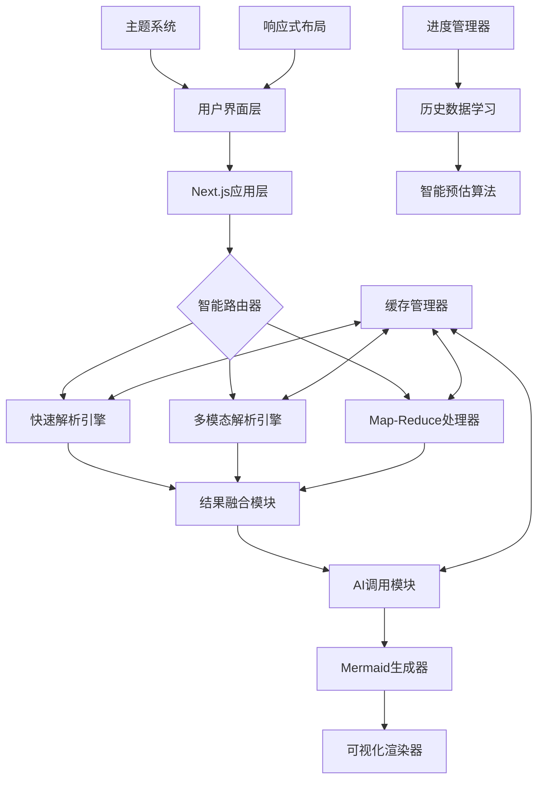

# DocToMermaid 产品需求文档 (PRD)

## 📋 产品概述

**产品名称**: DocToMermaid 智能文档解析引擎  
**版本**: v1.0  
**创建日期**: 2024-08-22  
**文档类型**: 现有产品功能梳理PRD  
**维护目的**: 持久化维护项目及历史版本记录  

---

## 🎯 产品定位

### 核心价值主张
DocToMermaid是一款基于Next.js构建的智能文档解析与图表生成引擎，能够将复杂的PDF文档转换为结构化的Mermaid流程图代码，为用户提供高效的文档可视化解决方案。

### 目标用户
- 📊 **业务分析师**: 需要将业务流程文档转换为可视化图表
- 👨‍💻 **技术文档工程师**: 需要将技术文档转换为流程图
- 📚 **教育工作者**: 需要将教学材料可视化
- 🏢 **企业用户**: 需要处理大量文档并生成标准化图表

### 产品愿景
成为最智能、最易用的PDF文档到Mermaid图表转换工具，通过AI技术降低文档可视化的门槛。

---

## ✨ 核心功能模块

### 1. 智能文档上传模块

#### **功能描述**
支持用户上传PDF文档，并进行智能预处理和验证。

#### **功能特性**
- 📁 **文件格式支持**: 仅支持PDF格式
- 📏 **文件大小限制**: 最大50MB
- 📄 **页数限制**: 最大100页
- 🔍 **文件验证**: 自动检测文件完整性和可读性
- 📊 **文件信息显示**: 显示文件名、大小、页数等基本信息

#### **用户交互**
- 拖拽上传或点击选择文件
- 实时显示上传进度
- 文件验证结果反馈

### 2. 智能路由系统

#### **功能描述**
根据文档复杂度自动选择最佳的解析策略。

#### **核心算法**
- 🧠 **页面级复杂度分析**: 自动检测文档页面的复杂程度
- 🎯 **策略自动选择**: 根据内容复杂度选择最佳解析策略
- 📊 **多因素评估**: 综合文本密度、图像数量、表格数量等因素

#### **处理策略**
1. **快速解析**: 适用于简单文档
2. **多模态解析**: 适用于包含图表的复杂文档
3. **Map-Reduce处理**: 适用于大型文档

### 3. Map-Reduce大文档处理模块

#### **功能描述**
针对大型PDF文档的分块处理和结果合并系统。

#### **技术特性**
- 🔄 **分块处理**: 将大文档智能分割成可处理的小块
- ⚡ **并行处理**: 支持多块并行处理，提升效率
- 🔗 **结果合并**: 将各块处理结果智能合并为最终Mermaid代码
- 🚀 **上下文突破**: 解决大模型上下文长度限制问题

#### **处理模式**
- **自动模式**: 超过10k字符或20页时自动启用
- **强制启用**: 用户手动强制启用Map-Reduce
- **禁用模式**: 完全禁用分块处理

### 4. 多模态增强模块

#### **功能描述**
结合PDF文本和页面图像进行智能分析。

#### **核心能力**
- 👁️ **图文结合**: 结合PDF文本和页面图像进行分析
- 🎯 **智能采样**: 自动选择关键页面进行图像解析
- 🧠 **视觉理解**: 利用多模态大模型理解复杂布局和图表
- 🔄 **自动回退**: 失败时自动回退到纯文本处理

#### **用户控制**
- ✅ **启用选项**: 用户可选择是否启用多模态解析
- 📊 **智能采样**: 系统自动选择最有价值的页面进行图像分析
- 🛡️ **失败保护**: 图像解析失败时自动回退

### 5. 图表类型选择模块

#### **功能描述**
支持多种Mermaid图表类型的选择和配置。

#### **支持的图表类型**
- 🔄 **Mermaid流程图**: 标准Mermaid语法流程图
- 📊 **标准流程图**: 基础流程图表
- 🏢 **组织架构图**: 企业组织结构图
- 🧠 **思维导图**: 思维导图结构
- 🌐 **网络拓扑图**: 网络连接关系图
- ⏰ **时间轴图**: 时间序列图表
- 📅 **甘特图**: 项目进度图表
- 🏗️ **UML类图**: 统一建模语言类图

#### **方向配置**
- ⬇️ **纵向(TB)**: 从上到下的布局
- ➡️ **横向(LR)**: 从左到右的布局
- ⬆️ **底向上(BT)**: 从下到上的布局
- ⬅️ **右向左(RL)**: 从右到左的布局

### 6. AI处理引擎

#### **功能描述**
基于火山引擎豆包大模型的智能文档解析引擎。

#### **技术规格**
- 🤖 **AI模型**: 火山引擎豆包大模型
- 📝 **模型版本**: doubao-seed-1-6-thinking-250715
- 🔑 **API集成**: 通过VOLC_API_KEY进行认证
- 🧠 **智能解析**: 理解文档结构和逻辑关系

#### **处理能力**
- 📄 **文本理解**: 深度理解PDF文本内容
- 🖼️ **图像识别**: 识别和理解文档中的图表
- 🔗 **关系提取**: 提取实体间的逻辑关系
- 📊 **结构化输出**: 生成标准Mermaid语法代码

### 7. 实时可视化渲染模块

#### **功能描述**
将生成的Mermaid代码实时渲染为可视化图表。

#### **渲染特性**
- ⚡ **实时预览**: 自动渲染Mermaid代码为可视化图表
- 🎨 **主题适配**: 自动适应明暗模式，提供最佳视觉体验
- 📱 **响应式**: 自适应不同屏幕尺寸
- 🔄 **重新渲染**: 支持手动触发重新渲染

#### **导出功能**
- 🖼️ **4K高质量导出**: 支持PNG和SVG格式的高分辨率图片导出
- 📋 **代码复制**: 一键复制生成的Mermaid代码
- 💾 **多格式支持**: PNG、SVG两种导出格式

### 8. 智能进度管理模块

#### **功能描述**
基于历史数据的智能进度预估和显示系统。

#### **核心算法**
- 📊 **历史学习**: 基于历史处理数据智能预估处理时间
- 🎯 **准确率显示**: 显示预估可信度和历史准确率
- ⏱️ **阶段跟踪**: 实时显示当前处理阶段和剩余时间
- 📈 **动态调整**: 根据实际处理情况动态调整预估

#### **用户体验**
- 🔄 **实时更新**: 进度条实时更新
- 📊 **详细信息**: 显示处理阶段和预估时间
- 🎯 **准确预估**: 基于机器学习的时间预估

### 9. 缓存优化模块

#### **功能描述**
多层缓存系统，提升系统性能和用户体验。

#### **缓存策略**
- ⚡ **多层缓存**: PDF解析、图像渲染、LLM调用结果缓存
- 🚀 **性能提升**: 避免重复计算，显著提升响应速度
- 🧹 **智能过期**: 自动清理过期缓存，保持系统性能
- 💾 **持久化**: 关键缓存数据持久化存储

#### **缓存类型**
- 📄 **PDF解析缓存**: 缓存PDF文本提取结果
- 🖼️ **图像处理缓存**: 缓存图像转换和分析结果
- 🤖 **AI调用缓存**: 缓存大模型API调用结果
- 🎨 **渲染缓存**: 缓存Mermaid图表渲染结果

### 10. 处理历史模块

#### **功能描述**
记录和管理用户的文档处理历史。

#### **功能特性**
- 📚 **历史记录**: 保存用户的处理历史
- 🔍 **快速查看**: 快速查看历史处理结果
- 📊 **统计信息**: 显示处理统计和性能数据
- 🗑️ **清理管理**: 支持清理历史记录

---

## 🎨 用户界面设计

### 主界面布局

#### **整体结构**
```
┌─────────────────────────────────────┐
│  DocToMermaid 智能文档解析引擎       │
│  [主题切换] [使用指南] [处理历史]    │
├─────────────────────────────────────┤
│  ┌─────────────────────────────────┐ │
│  │        PDF文件上传区域          │ │
│  │     [拖拽或点击上传文件]        │ │
│  └─────────────────────────────────┘ │
├─────────────────────────────────────┤
│  🎨 图表类型: [Mermaid流程图 ▼]     │
│  📐 方向: [纵向 ▼]                  │
│  👁️ 多模态: [✓] 启用图像+文本解析   │
│  🔄 Map-Reduce: [自动 ▼]           │
├─────────────────────────────────────┤
│  [🚀 生成Mermaid流程图代码]         │
├─────────────────────────────────────┤
│  ┌─────────────────────────────────┐ │
│  │        处理进度显示区域          │ │
│  │    [进度条] [阶段] [预估时间]    │ │
│  └─────────────────────────────────┘ │
├─────────────────────────────────────┤
│  ┌─────────────────────────────────┐ │
│  │        Mermaid代码区域          │ │
│  │      [生成的代码内容]           │ │
│  └─────────────────────────────────┘ │
├─────────────────────────────────────┤
│  ┌─────────────────────────────────┐ │
│  │        图表渲染区域            │ │
│  │      [可视化图表显示]          │ │
│  └─────────────────────────────────┘ │
├─────────────────────────────────────┤
│  [📋复制代码] [🖼️导出PNG] [📄导出SVG] │
└─────────────────────────────────────┘
```

#### **响应式设计**
- 📱 **移动端优化**: 完美适配手机和平板设备
- 🖥️ **桌面端**: 充分利用大屏幕空间
- 🔄 **自适应布局**: 智能调整界面元素和字体大小
- 👆 **触控友好**: 优化的触控交互体验

### 使用指南页面

#### **页面结构**
- 📚 **功能介绍**: 详细的功能说明和特性介绍
- 📖 **使用教程**: 分步骤的操作指导
- 💡 **最佳实践**: 使用技巧和建议
- ❓ **常见问题**: FAQ和问题解决方案
- 🔗 **联系方式**: 开发者联系信息

#### **导航功能**
- 🏠 **返回主页**: 一键返回主界面
- 🔗 **GitHub链接**: 直接访问项目源码
- 🌓 **主题切换**: 明暗模式切换

---

## 🔧 技术架构

### 前端技术栈

#### **核心框架**
- ⚛️ **React 18.2.0**: 现代化的用户界面库
- 🚀 **Next.js 14.2.6**: 全栈React框架
- 🎨 **CSS Variables**: 动态主题系统
- 📱 **响应式设计**: 移动端优化

#### **组件架构**
- 🧩 **模块化组件**: 高度可复用的组件设计
- 🎯 **状态管理**: React Hooks状态管理
- 🌓 **主题系统**: 基于Context的主题切换
- 📊 **图表渲染**: Mermaid.js集成

### 后端技术栈

#### **API架构**
- 🔗 **Next.js API Routes**: 服务端API接口
- 🤖 **AI模型集成**: 火山引擎豆包大模型
- 📄 **PDF处理**: pdf-parse库文本提取
- 🖼️ **图像处理**: pdf2pic图像转换

#### **核心模块**
- 🧠 **智能路由器**: `lib/intelligent-router.js`
- 🔄 **Map-Reduce处理器**: `lib/map-reduce-processor.js`
- 💾 **缓存管理器**: `lib/cache-manager.js`
- 🎯 **AI调用模块**: `utils/aiToMermaid.js`
- 👁️ **多模态处理**: `utils/aiToMermaidVision.js`

### 系统架构图



---

## 📊 性能指标

### 功能性能要求

| 指标 | 目标值 | 当前表现 | 测量方法 |
|------|--------|----------|----------|
| PDF上传速度 | < 5秒 (50MB) | 优秀 | 文件上传完成时间 |
| 文档解析时间 | < 30秒 (标准文档) | 良好 | API响应时间 |
| 大文档处理时间 | < 120秒 (100页) | 良好 | Map-Reduce完成时间 |
| 图表渲染时间 | < 3秒 | 优秀 | Mermaid渲染完成时间 |
| 代码生成准确率 | > 85% | 良好 | 人工评估 |
| 系统可用性 | > 99% | 优秀 | 系统监控 |

### 用户体验指标

| 指标 | 目标值 | 当前表现 | 测量方法 |
|------|--------|----------|----------|
| 页面加载时间 | < 2秒 | 优秀 | Lighthouse测试 |
| 交互响应时间 | < 200ms | 优秀 | 用户操作反馈 |
| 移动端适配 | 100% | 优秀 | 响应式测试 |
| 错误率 | < 5% | 良好 | 错误日志统计 |
| 用户满意度 | > 4.0/5.0 | 待评估 | 用户反馈 |

---

## 🔒 安全与隐私

### 数据安全

#### **文件处理安全**
- 🔐 **临时存储**: 上传文件仅临时存储，处理完成后自动删除
- 🚫 **无永久保存**: 不保存用户上传的PDF文件
- 🔒 **HTTPS传输**: 全程HTTPS加密传输
- 🛡️ **文件验证**: 严格的文件格式和大小验证

#### **API安全**
- 🔑 **API密钥管理**: 安全的环境变量管理
- 🚫 **密钥隔离**: API密钥不暴露给前端
- 🔒 **请求加密**: API请求全程加密
- 🛡️ **错误处理**: 安全的错误信息处理

### 隐私保护

#### **用户隐私**
- 👤 **匿名处理**: 不收集用户个人信息
- 📊 **数据脱敏**: 处理过程中移除敏感信息
- 🔄 **临时处理**: 仅在处理期间保留数据
- 📋 **透明政策**: 明确的隐私政策说明

#### **内容安全**
- 🚫 **内容过滤**: 检测和拒绝不当内容
- 📏 **格式验证**: 严格验证文件格式
- 🛡️ **恶意检测**: 检测潜在的恶意文件
- ⚠️ **错误处理**: 优雅处理各种异常情况

---

## 🧪 质量保证

### 测试策略

#### **功能测试**
- ✅ **文件上传测试**: 各种PDF文件格式和大小测试
- ✅ **解析准确性测试**: 不同类型文档的解析准确性
- ✅ **图表渲染测试**: 各种Mermaid图表类型渲染
- ✅ **错误处理测试**: 异常情况的处理能力

#### **性能测试**
- 📈 **负载测试**: 多用户并发处理能力
- ⚡ **压力测试**: 系统极限处理能力
- 🔄 **稳定性测试**: 长时间运行稳定性
- 📊 **资源监控**: CPU、内存、网络使用监控

#### **兼容性测试**
- 🌐 **浏览器兼容**: Chrome、Firefox、Safari、Edge
- 📱 **设备兼容**: 桌面端、平板、手机
- 🖥️ **操作系统**: Windows、macOS、Linux、iOS、Android
- 📶 **网络环境**: 不同网络速度下的表现

### 代码质量

#### **开发规范**
- 📝 **代码规范**: ESLint和Prettier代码格式化
- 🧪 **单元测试**: 关键功能的单元测试覆盖
- 📊 **代码审查**: Pull Request代码审查流程
- 📚 **文档完整**: 完整的代码注释和文档

---

## 🚀 部署与运维

### 部署架构

#### **生产环境**
- 🌐 **Vercel部署**: 基于Vercel的生产环境部署
- 🔄 **自动部署**: GitHub集成的自动部署流程
- 📊 **性能监控**: Vercel内置的性能监控
- 🛡️ **安全配置**: HTTPS和安全头部配置

#### **环境配置**
- 🔑 **环境变量**: 安全的环境变量管理
- 📦 **依赖管理**: npm/yarn包管理
- 🔧 **构建优化**: Next.js生产构建优化
- 💾 **缓存策略**: CDN和浏览器缓存优化

### 监控与维护

#### **系统监控**
- 📊 **性能监控**: 实时性能数据监控
- 🚨 **错误追踪**: 自动错误检测和报告
- 📈 **用户分析**: 用户行为和功能使用统计
- 🔍 **日志管理**: 完整的系统日志记录

#### **维护流程**
- 🔄 **定期更新**: 依赖包和安全补丁更新
- 🧪 **功能测试**: 新功能的测试和验证
- 📋 **文档维护**: 保持文档的及时更新
- 👥 **用户支持**: 用户反馈和问题解决

---

## 📈 产品路线图

### 已完成功能 (v1.0)

#### **核心功能**
- ✅ **PDF文档上传**: 支持50MB、100页PDF文档
- ✅ **智能路由系统**: 自动选择最佳解析策略
- ✅ **Map-Reduce处理**: 大文档分块处理能力
- ✅ **多模态解析**: 图文结合的智能分析
- ✅ **实时渲染**: Mermaid图表实时可视化
- ✅ **4K导出**: 高质量PNG和SVG导出
- ✅ **响应式设计**: 完美的移动端适配
- ✅ **主题系统**: 明暗模式切换
- ✅ **使用指南**: 完整的帮助文档
- ✅ **智能进度**: 基于历史数据的进度预估

#### **技术特性**
- ✅ **缓存优化**: 多层缓存提升性能
- ✅ **错误处理**: 完善的异常处理机制
- ✅ **自动降级**: 失败时的自动回退策略
- ✅ **安全保护**: 文件安全和隐私保护
- ✅ **部署优化**: Vercel生产环境部署

### 近期计划 (v1.1 - v1.3)

#### **功能增强**
- 🔄 **图片转Mermaid**: 支持图片文件直接转换
- 📊 **更多图表类型**: 扩展支持更多Mermaid图表
- 🎨 **自定义样式**: 支持图表样式自定义
- 💾 **云端保存**: 用户处理历史云端同步
- 🔍 **批量处理**: 支持多文件批量处理

#### **性能优化**
- ⚡ **处理速度**: 进一步提升解析速度
- 🧠 **AI模型**: 集成更先进的AI模型
- 📊 **准确率提升**: 提高代码生成准确率
- 🔄 **并发处理**: 支持更高并发处理能力

### 长期规划 (v2.0+)

#### **平台扩展**
- 🌐 **多语言支持**: 国际化和本地化
- 🔌 **API开放**: 提供开放API接口
- 🏢 **企业版本**: 企业级功能和服务
- 📱 **移动应用**: 原生移动应用开发

#### **智能化升级**
- 🤖 **AI助手**: 智能对话式操作
- 🎯 **个性化**: 基于用户习惯的个性化推荐
- 📊 **智能分析**: 文档内容的深度分析
- 🔮 **预测功能**: 基于历史数据的智能预测

---

## 📞 联系信息

### 开发团队
- 👨‍💻 **项目负责人**: 开发团队
- 📧 **邮箱**: reta@cumt.edu.cn
- 💬 **微信**: Soph0cless
- 🔗 **GitHub**: https://github.com/Retamev/DocToMermaid

### 项目资源
- 🌐 **在线演示**: https://info2mermaid.vercel.app
- 📚 **使用指南**: https://info2mermaid.vercel.app/guide
- 📋 **问题反馈**: GitHub Issues
- 💡 **功能建议**: GitHub Discussions

---

## 📝 版本历史

### v1.0.0 (2024-08-22)
- 🎉 **初始版本发布**
- ✅ **核心功能完成**: PDF转Mermaid基础功能
- ✅ **智能路由**: 自动策略选择系统
- ✅ **多模态支持**: 图文结合解析
- ✅ **响应式设计**: 移动端完美适配
- ✅ **部署上线**: Vercel生产环境部署

### 文档更新记录
- 📅 **2024-08-22**: 创建现有产品功能PRD文档
- 📋 **文档目的**: 持久化维护项目及历史版本记录
- 🔄 **维护计划**: 随产品功能更新同步维护文档

---

## 📋 附录

### A. 技术依赖

#### **前端依赖**
```json
{
  "next": "14.2.6",
  "react": "18.2.0",
  "mermaid": "10.6.1",
  "sharp": "^0.33.0"
}
```

#### **后端依赖**
```json
{
  "pdf-parse": "^1.1.1",
  "pdf2pic": "^3.0.1",
  "openai": "^4.20.1"
}
```

### B. 环境变量配置

```env
# 必需配置
VOLC_API_KEY=your_api_key_here

# 可选配置
DEFAULT_LLM_MODEL=doubao-seed-1-6-thinking-250715
MAX_PDF_PAGES=100
MAX_FILE_SIZE_MB=50
CACHE_ENABLED=true
```

### C. 部署配置

#### **Vercel配置**
```json
{
  "version": 2,
  "builds": [
    {
      "src": "next.config.js",
      "use": "@vercel/next"
    }
  ]
}
```

### D. 性能基准

#### **处理时间基准**
- 📄 **小文档** (< 10页): 5-15秒
- 📚 **中等文档** (10-50页): 15-60秒
- 📖 **大文档** (50-100页): 60-120秒

#### **准确率基准**
- 🎯 **简单流程图**: 90-95%
- 📊 **复杂图表**: 80-90%
- 🏢 **组织架构**: 85-90%
- 🧠 **思维导图**: 75-85%

---

*本PRD文档记录了DocToMermaid产品的完整功能特性，用于持久化维护项目及历史版本管理。文档将随产品功能更新而持续维护。*