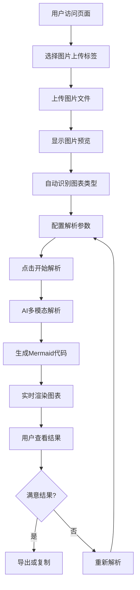

# 图片转Mermaid功能 PRD

## 📋 产品需求文档 (Product Requirements Document)

**版本**: v1.0  
**创建日期**: 2025-08-22  
**负责人**: 产品开发团队  
**状态**: 待审阅  

---

## 🎯 产品概述

### 功能定位
在现有PDF转Mermaid功能基础上，新增**图片转Mermaid**功能，支持用户上传包含流程图、组织架构图、思维导图等图表的图片，通过多模态AI解析生成对应的Mermaid代码。

### 产品价值
- **扩展输入源**：从单一PDF文档扩展到图片格式
- **提升便利性**：用户可直接上传手绘图、截图、照片等
- **增强可用性**：覆盖更多使用场景和用户需求
- **技术创新**：展示多模态AI在图表识别领域的应用

---

## 👥 目标用户

### 主要用户群体
1. **业务分析师**：需要将手绘流程图数字化
2. **产品经理**：将白板讨论结果转换为标准图表
3. **开发工程师**：将架构草图转换为文档图表
4. **教育工作者**：将教学图表转换为可编辑格式
5. **咨询顾问**：将客户现有图表标准化

### 用户场景
- 📱 **移动办公**：手机拍摄白板内容后转换
- 🖼️ **图片处理**：已有图片资源的重新利用
- ✏️ **手绘转换**：手绘草图的数字化处理
- 📊 **格式转换**：其他格式图表的标准化

---

## 🚀 功能需求

### 核心功能 (MVP)

#### 1. 图片上传功能
**功能描述**: 支持用户上传包含图表的图片文件

**具体需求**:
- ✅ **支持格式**: JPG, PNG, WEBP, BMP
- ✅ **文件大小**: 最大10MB
- ✅ **图片尺寸**: 最大4096x4096像素
- ✅ **上传方式**: 拖拽上传、点击选择、粘贴上传
- ✅ **预览功能**: 上传后显示图片预览

**大图片处理策略**:
- 🔍 **智能压缩**: 超过1536x1536像素自动等比压缩至最大边1536（fit: inside）
- 📏 **尺寸检测**: 自动检测图片尺寸并提示用户
- ⚡ **分辨率优化**: 保持图表清晰度的前提下优化文件大小
- 🎯 **区域裁剪**: 智能识别图表区域，自动裁剪无关背景
- 📊 **质量平衡**: 在处理速度和识别准确率之间找到最佳平衡

**图片预览功能**:
- 🖼️ **即时预览**: 上传完成后立即显示预览
- 🔍 **缩放查看**: 支持鼠标滚轮缩放查看细节
- 📐 **尺寸信息**: 显示图片原始尺寸和文件大小
- 🎨 **预处理预览**: 显示压缩/裁剪后的效果对比
- 🔄 **重新上传**: 支持替换当前图片

**验收标准**:
- 支持主流图片格式上传
- 文件大小和尺寸限制生效
- 上传进度显示正常
- 预览图片清晰可见
- 大图片自动处理不影响用户体验
- 预览功能响应流畅

#### 2. 图表类型识别
**功能描述**: 自动识别图片中的图表类型

**支持类型** (与现有系统保持完全一致，确保引擎稳定性):
- 🔄 **流程图** (Flowchart) - 复用现有渲染引擎
- 📊 **序列图** (Sequence Diagram) - 复用现有渲染引擎
- 🏗️ **类图** (Class Diagram) - 复用现有渲染引擎
- 🌐 **状态图** (State Diagram) - 复用现有渲染引擎
- 📈 **甘特图** (Gantt Chart) - 复用现有渲染引擎
- 🎯 **饼图** (Pie Chart) - 复用现有渲染引擎

**设计原则**:
- ✅ **引擎复用**: 完全复用现有ChartTypeSelector组件
- ✅ **稳定性优先**: 不引入新的图表类型避免兼容性问题
- ✅ **渐进增强**: 后续版本可根据需求扩展新类型

**验收标准**:
- 能够准确识别现有支持的图表类型
- 识别准确率 > 80%
- 不支持的类型给出明确提示并建议使用PDF上传

#### 3. 多模态AI解析
**功能描述**: 使用多模态AI模型解析图片内容

**技术要求**:
- 🤖 **AI模型**: 使用火山引擎多模态大模型
- 🔍 **解析能力**: 识别图形、文字、连接关系
- 📝 **结构化输出**: 生成结构化的图表描述
- 🎯 **准确性**: 解析准确率 > 75%

**验收标准**:
- 能够识别图片中的文字内容
- 能够理解图形之间的连接关系
- 生成的描述结构化且准确

#### 4. Mermaid代码生成
**功能描述**: 将解析结果转换为Mermaid代码

**生成规则**:
- 📋 **语法正确**: 生成符合Mermaid语法的代码
- 🎨 **样式优化**: 包含适当的样式和布局
- 🔤 **中文支持**: 正确处理中文字符
- 📐 **布局合理**: 自动选择最佳布局方向

**验收标准**:
- 生成的Mermaid代码语法正确
- 能够正常渲染为图表
- 图表结构与原图基本一致

#### 5. 实时预览渲染
**功能描述**: 实时渲染生成的Mermaid代码

**功能特性**:
- ⚡ **实时渲染**: 代码生成后立即渲染
- 🎨 **主题适配**: 支持明暗主题
- 📱 **响应式**: 适配不同屏幕尺寸
- 🔄 **重新生成**: 支持重新解析和生成

**验收标准**:
- 渲染速度 < 3秒
- 图表显示清晰完整
- 主题切换正常工作

### 增强功能 (后续版本)

#### 1. 批量处理
- 📁 **多图片上传**: 支持同时上传多张图片
- 🔄 **批量转换**: 一键转换所有图片
- 📊 **进度跟踪**: 显示批量处理进度

#### 2. 智能优化
- 🔧 **图片预处理**: 自动调整对比度、亮度
- 🎯 **区域识别**: 智能裁剪图表区域
- 📝 **OCR增强**: 提升文字识别准确率

#### 3. 编辑功能
- ✏️ **代码编辑**: 支持手动编辑生成的代码
- 🔄 **实时同步**: 编辑时实时更新预览
- 💾 **版本管理**: 保存编辑历史

---

## 🎨 用户界面设计

### 页面布局

#### 主界面优化设计
**采用页签切换方式整合不同上传类型**

```
┌─────────────────────────────────────┐
│  PDF → Mermaid 生成器               │
├─────────────────────────────────────┤
│  ┌─────────┐ ┌─────────┐            │
│  │ PDF上传 │ │ 图片上传 │ ← 页签切换  │
│  └─────────┘ └─────────┘            │
├─────────────────────────────────────┤
│  ┌─────────────┐  ┌─────────────┐   │
│  │   上传区域   │  │   预览区域   │   │
│  │ 拖拽或点击   │  │ 图片预览显示 │   │
│  │   上传文件   │  │ 支持缩放查看 │   │
│  └─────────────┘  └─────────────┘   │
├─────────────────────────────────────┤
│  🎨 图表类型: [与现有按钮保持一致]   │
│  ⚙️ 解析选项: [精度] [大图处理]     │
├─────────────────────────────────────┤
│  ┌─────────────┐  ┌─────────────┐   │
│  │ Mermaid代码 │  │  图表渲染   │   │
│  │             │  │             │   │
│  │             │  │             │   │
│  └─────────────┘  └─────────────┘   │
├─────────────────────────────────────┤
│  [复制代码] [导出PNG] [导出SVG]     │
└─────────────────────────────────────┘
```

#### 页签切换设计
- 🔄 **无缝切换**：点击页签即可切换上传模式
- 💾 **状态保持**：切换页签时保持当前处理状态
- 🎨 **视觉统一**：页签样式与整体UI风格一致
- 📱 **响应式**：移动端自动适配为下拉选择

#### 图片上传区域
- 🎯 **拖拽区域**: 大尺寸拖拽上传区
- 📎 **文件选择**: 点击选择文件按钮
- 📋 **粘贴支持**: Ctrl+V粘贴图片
- 📊 **格式提示**: 显示支持的文件格式
- ⚡ **进度条**: 上传进度实时显示

#### 解析配置面板
- 🎛️ **图表类型**: 自动识别 + 手动选择
- 🔧 **解析精度**: 快速/标准/精确模式
- 🎨 **输出样式**: 简洁/详细/自定义
- 📐 **布局方向**: 自动/横向/纵向

### 交互流程

#### 标准使用流程


---

## 🔧 技术实现方案

### 技术架构

#### 前端技术栈
- ⚛️ **React 18**: 用户界面框架
- 🚀 **Next.js 14**: 全栈框架
- 🎨 **CSS Modules**: 样式管理
- 📱 **响应式设计**: 移动端适配
- 🖼️ **图片处理**: Canvas API + File API

#### 后端技术栈
- 🔥 **Next.js API Routes**: 服务端API
- 🤖 **火山引擎多模态大模型**: 图片解析
- 📝 **图片预处理**: Sharp.js 图片处理
- 💾 **临时存储**: 内存缓存 + 文件系统

### API设计

#### 图片上传接口
```javascript
POST /api/image/upload
Content-Type: multipart/form-data

// 请求参数
{
  file: File,           // 图片文件
  options: {
    chartType: string,  // 图表类型 (可选)
    quality: string,    // 解析质量
    direction: string   // 布局方向
  }
}

// 响应结果
{
  success: boolean,
  data: {
    imageId: string,    // 图片ID
    imageUrl: string,   // 预览URL
    metadata: {
      width: number,
      height: number,
      format: string,
      size: number
    }
  }
}
```

#### 图片解析接口
```javascript
POST /api/image/analyze
Content-Type: application/json

// 请求参数
{
  imageId: string,      // 图片ID
  chartType: string,    // 图表类型
  options: {
    quality: 'fast' | 'standard' | 'precise',
    direction: 'auto' | 'TB' | 'LR',
    style: 'simple' | 'detailed' | 'custom'
  }
}

// 响应结果
{
  success: boolean,
  data: {
    chartType: string,     // 识别的图表类型
    confidence: number,    // 识别置信度
    mermaidCode: string,   // 生成的Mermaid代码
    description: string,   // 图表描述
    elements: {
      nodes: Array,        // 节点信息
      edges: Array,        // 连接信息
      labels: Array        // 文字标签
    }
  }
}
```

### 核心算法

#### 图片预处理流程
```javascript
// 智能图片预处理管道
const preprocessImage = async (imageBuffer, options = {}) => {
  const metadata = await sharp(imageBuffer).metadata();
  
  // 大图片处理策略
  const shouldCompress = metadata.width > 2048 || metadata.height > 2048;
  const targetSize = shouldCompress ? 
    { width: 2048, height: 2048, fit: 'inside', withoutEnlargement: true } :
    undefined;
  
  let pipeline = sharp(imageBuffer);
  
  // 智能压缩
  if (targetSize) {
    pipeline = pipeline.resize(targetSize);
  }
  
  // 图像增强
  pipeline = pipeline
    .normalize()                    // 标准化对比度
    .sharpen()                     // 锐化处理
    .modulate({                    // 调整饱和度和亮度
      brightness: 1.1,
      saturation: 0.9
    });
  
  // 智能区域裁剪（可选）
  if (options.autoCrop) {
    pipeline = pipeline.trim({ threshold: 10 });
  }
  
  // 输出优化
  return pipeline
    .png({ 
      quality: 90,
      compressionLevel: 6,
      adaptiveFiltering: true
    })
    .toBuffer();
};

// 图片预览生成
const generatePreview = async (imageBuffer) => {
  return sharp(imageBuffer)
    .resize({ width: 800, height: 600, fit: 'inside' })
    .jpeg({ quality: 85 })
    .toBuffer();
};
```

#### AI解析提示词设计
```javascript
const generatePrompt = (chartType, options) => {
  return `
请分析这张图片中的${chartType}，并按以下要求生成Mermaid代码：

1. 识别所有节点和连接关系
2. 提取文字标签和描述
3. 理解图表的层次结构
4. 生成符合Mermaid语法的代码
5. 使用${options.direction}布局方向
6. 采用${options.style}样式风格

请确保：
- 代码语法正确
- 中文字符正确处理
- 布局清晰美观
- 保持原图的逻辑关系
  `;
};
```

---

## 📊 性能指标

### 功能性能要求

| 指标 | 目标值 | 测量方法 |
|------|--------|----------|
| 图片上传速度 | < 5秒 (10MB) | 上传完成时间 |
| 大图片压缩时间 | < 3秒 (4K图片) | 预处理完成时间 |
| 图片预览生成 | < 1秒 | 预览显示时间 |
| 图表识别准确率 | > 80% | 人工评估 |
| 代码生成准确率 | > 75% | 渲染成功率 |
| 解析响应时间 | < 15秒 (标准图片) | API响应时间 |
| 解析响应时间 | < 25秒 (大图片) | API响应时间 |
| 图表渲染时间 | < 3秒 | 前端渲染时间 |
| 预览缩放响应 | < 200ms | 用户交互响应 |

### 用户体验指标

| 指标 | 目标值 | 测量方法 |
|------|--------|----------|
| 页面加载时间 | < 2秒 | Lighthouse |
| 交互响应时间 | < 200ms | 用户操作反馈 |
| 移动端适配 | 100% | 响应式测试 |
| 错误率 | < 5% | 错误日志统计 |

---

## 🔒 安全与隐私

### 数据安全
- 🔐 **文件加密**: 上传文件临时加密存储
- 🗑️ **自动清理**: 处理完成后自动删除临时文件
- 🚫 **无永久存储**: 不保存用户上传的图片
- 🔒 **HTTPS传输**: 全程HTTPS加密传输

### 隐私保护
- 👤 **匿名处理**: 不收集用户个人信息
- 📊 **数据脱敏**: AI处理时移除敏感信息
- 🔄 **临时处理**: 仅在处理期间保留数据
- 📋 **透明政策**: 明确的隐私政策说明

### 内容安全
- 🚫 **内容过滤**: 检测和拒绝不当内容
- 📏 **格式验证**: 严格验证文件格式和大小
- 🛡️ **恶意检测**: 检测潜在的恶意文件
- ⚠️ **错误处理**: 优雅处理各种异常情况

---

## 🧪 测试策略

### 功能测试

#### 图片上传测试
- ✅ **格式兼容性**: 测试所有支持的图片格式
- ✅ **大小限制**: 测试文件大小边界条件
- ✅ **上传方式**: 测试拖拽、点击、粘贴上传
- ✅ **错误处理**: 测试不支持格式的错误提示

#### 解析功能测试
- 📊 **图表类型**: 测试各种图表类型的识别
- 🎯 **准确性**: 测试解析结果的准确性
- ⚡ **性能**: 测试不同大小图片的处理时间
- 🔄 **稳定性**: 测试连续处理的稳定性

#### 渲染功能测试
- 🎨 **代码正确性**: 验证生成的Mermaid代码语法
- 📱 **响应式**: 测试不同屏幕尺寸的显示效果
- 🌓 **主题适配**: 测试明暗主题的切换效果
- 🖼️ **导出功能**: 测试PNG和SVG导出质量

### 性能测试
- 📈 **负载测试**: 模拟多用户同时使用
- ⚡ **压力测试**: 测试系统极限处理能力
- 🔄 **稳定性测试**: 长时间运行稳定性
- 📊 **资源监控**: 监控CPU、内存、网络使用

### 兼容性测试
- 🌐 **浏览器兼容**: Chrome, Firefox, Safari, Edge
- 📱 **设备兼容**: 桌面端、平板、手机
- 🖥️ **操作系统**: Windows, macOS, Linux, iOS, Android
- 📶 **网络环境**: 不同网络速度下的表现

---

## 🧭 优先级与实施顺序

### P0（必须优先实现，MVP闭环）
1. 首页新增“PDF上传 / 图片上传”页签切换，保持上下布局。
2. 图片上传与校验：支持 JPG/PNG/WebP/BMP；大小 ≤ 10MB；边长 ≤ 4096。
3. 服务端预处理：超过 1536 边长则等比缩放至最大边 1536（fit: inside），质量 85~90。
4. 多模态解析：单图输入 → 生成 {chartType, mermaidCode}；失败有重试与友好提示。
5. 图表类型：ChartTypeSelector 补齐 Flowchart / Sequence / Class / State / Gantt / Pie；方向仅对 Flowchart 生效。
6. 渲染闭环：生成代码实时渲染、复制与导出（沿用现有组件）。

### P1（重要优化，体验与覆盖）
1. 处理模式：快速/标准/精确 三档，控制预处理尺寸、质量、超时与重试。
2. 自动识别类型与置信度展示，允许手动改选后重生成。
3. 预览增强：更顺滑缩放、全屏预览、基础性能调参。
4. 格式扩展：AVIF/HEIC 解码可用即启用；不可解码时提示转换/降级。

### P2（增强能力与复杂技术）
1. 超大图与分块识别（2048 分块 + 重叠 + 结果合并）。
2. 批量处理与进度管理（并发、重试、速率限制）。
3. 在线编辑/版本对比/回退，渲染同步导出。
4. 安全与合规增强（临时文件加密/清理、限流、审计）。

---

## 📅 开发计划

### 里程碑规划

#### Phase 1: 基础功能开发 (2周)
- **Week 1**:
  - [ ] 图片上传组件开发
  - [ ] 文件格式验证和预处理
  - [ ] 基础UI界面搭建
  - [ ] 图片预览功能

- **Week 2**:
  - [ ] AI解析API接口开发
  - [ ] 多模态模型集成
  - [ ] 基础图表类型识别
  - [ ] Mermaid代码生成逻辑

#### Phase 2: 功能完善 (2周)
- **Week 3**:
  - [ ] 实时渲染功能
  - [ ] 错误处理和用户反馈
  - [ ] 性能优化
  - [ ] 响应式设计适配

- **Week 4**:
  - [ ] 全面测试和调试
  - [ ] 用户体验优化
  - [ ] 文档编写
  - [ ] 部署和发布准备

#### Phase 3: 优化和发布 (1周)
- **Week 5**:
  - [ ] 最终测试和修复
  - [ ] 性能监控配置
  - [ ] 用户指南更新
  - [ ] 正式发布

### 资源需求
- 👨‍💻 **前端开发**: 1人 × 3周
- 👨‍💻 **后端开发**: 1人 × 3周
- 🤖 **AI集成**: 1人 × 2周
- 🧪 **测试**: 1人 × 2周
- 🎨 **UI设计**: 1人 × 1周

---

## 💰 成本评估

### 开发成本
- 👨‍💻 **人力成本**: 约15人天
- 🔧 **开发工具**: 现有工具链
- 🧪 **测试环境**: 现有测试环境

### 运营成本
- 🤖 **AI模型调用**: 按调用次数计费
- 💾 **存储成本**: 临时文件存储
- 🌐 **CDN成本**: 图片传输带宽
- 📊 **监控成本**: 性能监控服务

### 预期收益
- 📈 **用户增长**: 预计用户量增长30%
- 🎯 **使用频率**: 预计使用频率提升50%
- 💡 **产品价值**: 增强产品竞争力
- 🚀 **技术积累**: 多模态AI技术经验

---

## 🚨 风险评估

### 技术风险

| 风险 | 概率 | 影响 | 缓解措施 |
|------|------|------|----------|
| AI解析准确率不达标 | 中 | 高 | 多模型对比测试，优化提示词 |
| 图片处理性能问题 | 低 | 中 | 图片压缩，异步处理 |
| 多模态模型API限制 | 中 | 中 | 备用方案，本地模型 |
| 浏览器兼容性问题 | 低 | 低 | 渐进式增强，Polyfill |

### 产品风险

| 风险 | 概率 | 影响 | 缓解措施 |
|------|------|------|----------|
| 用户接受度不高 | 中 | 中 | 用户调研，功能优化 |
| 竞品功能类似 | 高 | 中 | 差异化特性，体验优化 |
| 使用成本过高 | 低 | 高 | 成本控制，免费额度 |
| 隐私安全担忧 | 中 | 高 | 透明政策，安全保障 |

### 运营风险

| 风险 | 概率 | 影响 | 缓解措施 |
|------|------|------|----------|
| 服务器负载过高 | 中 | 高 | 负载均衡，弹性扩容 |
| AI服务不稳定 | 低 | 高 | 多服务商，降级方案 |
| 恶意使用 | 中 | 中 | 频率限制，内容过滤 |
| 法律合规问题 | 低 | 高 | 合规审查，政策更新 |

---

## 📈 成功指标

### 产品指标
- 📊 **功能使用率**: 图片上传功能使用率 > 20%
- 🎯 **转换成功率**: 图片转Mermaid成功率 > 75%
- ⭐ **用户满意度**: 用户评分 > 4.0/5.0
- 🔄 **重复使用率**: 用户重复使用率 > 40%

### 技术指标
- ⚡ **响应时间**: 平均解析时间 < 15秒
- 🔧 **系统稳定性**: 可用性 > 99.5%
- 📱 **兼容性**: 主流浏览器兼容率 100%
- 🛡️ **安全性**: 零安全事故

### 业务指标
- 📈 **用户增长**: 月活用户增长 > 30%
- 💰 **成本控制**: AI调用成本在预算内
- 🚀 **功能采用**: 新功能采用率 > 25%
- 📊 **数据质量**: 生成代码质量评分 > 4.0/5.0

---

## 📞 联系信息

**产品负责人**: 开发团队  
**技术负责人**: 架构师  
**项目经理**: PM  
**设计负责人**: UI/UX设计师  

**邮箱**: reta@cumt.edu.cn  
**微信**: Soph0cless  
**GitHub**: https://github.com/Retamev/DocToMermaid  

---

## 📝 附录

### A. 竞品分析

| 产品 | 功能 | 优势 | 劣势 |
|------|------|------|------|
| Draw.io | 在线绘图 | 功能全面 | 不支持图片识别 |
| Lucidchart | 图表工具 | 协作功能强 | 付费产品 |
| PlantUML | 代码生图 | 代码化 | 学习成本高 |
| 本产品 | 图片转代码 | AI驱动，便捷 | 新功能，待验证 |

### B. 技术调研

#### 多模态AI模型对比
- **火山引擎**: 中文支持好，API稳定
- **OpenAI GPT-4V**: 功能强大，成本较高
- **Google Gemini**: 性能优秀，国内访问限制
- **百度文心**: 本土化好，功能相对简单

#### 图片处理库选择
- **Sharp.js**: 性能优秀，功能全面
- **Canvas API**: 浏览器原生，兼容性好
- **ImageMagick**: 功能强大，部署复杂
- **Pillow**: Python生态，不适合Node.js

### C. 用户调研结果

**调研方法**: 在线问卷 + 用户访谈  
**样本数量**: 100名潜在用户  
**关键发现**:
- 78% 用户有图片转图表的需求
- 65% 用户愿意使用AI辅助功能
- 主要使用场景: 工作汇报(45%), 学习笔记(30%), 项目文档(25%)
- 最关心的问题: 准确性(60%), 速度(25%), 隐私(15%)

---

*本PRD文档将根据开发进展和用户反馈持续更新完善。*